# MOD-EHR Administrator and User Guide

> **Environment note:** In Production and UAT, the **Patients**, **Appointments**, and **Logs** pages redirect straight back to the Dashboard for every role — they only render in Development. Day-to-day appointment work in Production/UAT happens entirely on the **Dashboard** page (see [Dashboard](#dashboard) below), not on a separate Appointments page. Keep this in mind throughout this guide — several screens described below are Development-only today.

## Administrator Guide

This section is intended for system administrators responsible for managing tenants and monitoring the overall health of the application.

### Accessing the Admin Portal

Administrators can log in through the EHR Admin Portal, available at:

- `https://admin.<domain>.com`

Administrator credentials will be provided during the initial setup of the EHR application.

### Registering a Hospital (Tenant)

1. Log in to the Admin Portal.
2. Navigate to the Hospitals tab.

   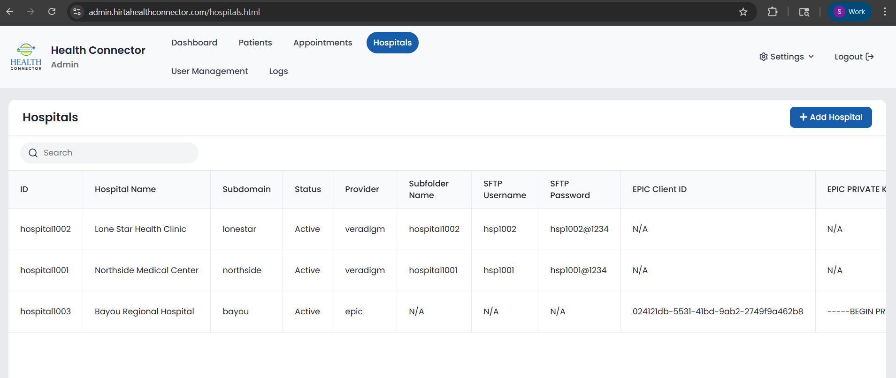

3. Click **Add Hospital** to register a new tenant.
4. Fill in the required details, including the appropriate provider credentials (Epic / Veradigm).

   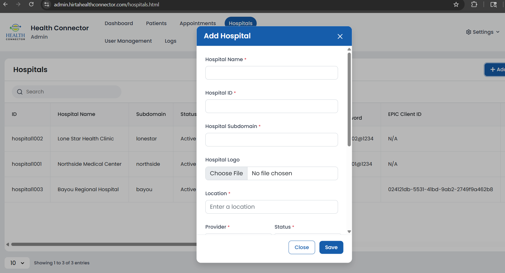

   **Veradigm:**
   - **S3 Subfolder Name:** The new folder that is to be created in the SFTP server. (Please use a unique folder name, like the Hospital ID.)
   - **SFTP Username:** The SFTP server username.
   - **SFTP Password:** The SFTP server user password.

   Note: Refer to the [Veradigm Integration setup guide](Veradigm-Integration-Multi-Tenant.md).

   **EPIC:**
   - EPIC Client ID
   - EPIC Private Key
   - EPIC JWKS URL
   - EPIC JWKS KID

   Note: Refer to the [EPIC Integration setup guide](EPIC-Integration-Multi-Tenant.md) for these credentials.

5. Click **Save** to register the hospital.

If the Hospital Status is set to **Active**, the tenant registration process is complete.

> **Security note:** The Hospitals table masks `SFTP Password` and `EPIC Private Key` as `*****` in the display. That masking is cosmetic, not a data boundary — the hospital list API returns every tenant's real secrets to any admin's browser on page load (that's how the Edit Hospital form is able to pre-fill the real value the moment you click Edit), and the value is retrievable from the page's underlying data even though the table cell itself is starred out. Treat access to the Hospitals tab as equivalent to access to every tenant's SFTP password and Epic private key.

### Creating Users for a Tenant

1. Navigate to the User Management tab.
2. Click **Add User**.

   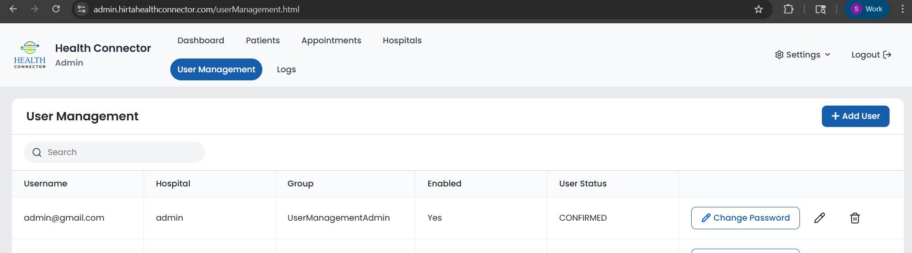

3. Enter the user details (username and password). Passwords must be at least 8 characters and include an uppercase letter, a lowercase letter, a digit, and a special character (`@$!%*?&`).
4. Select the Hospital and assign the appropriate Role to the user:
   - **Booking Admin** — can manage bookings/appointments for their hospital.
   - **View Only** — read-only access; cannot create, edit, or book anything.
   - **User Management Admin** — can manage users for their hospital. This option only appears when *you* are logged in as the platform admin (hospital `admin`) — a tenant-level User Management Admin cannot grant this role to anyone else, only Booking Admin or View Only.

   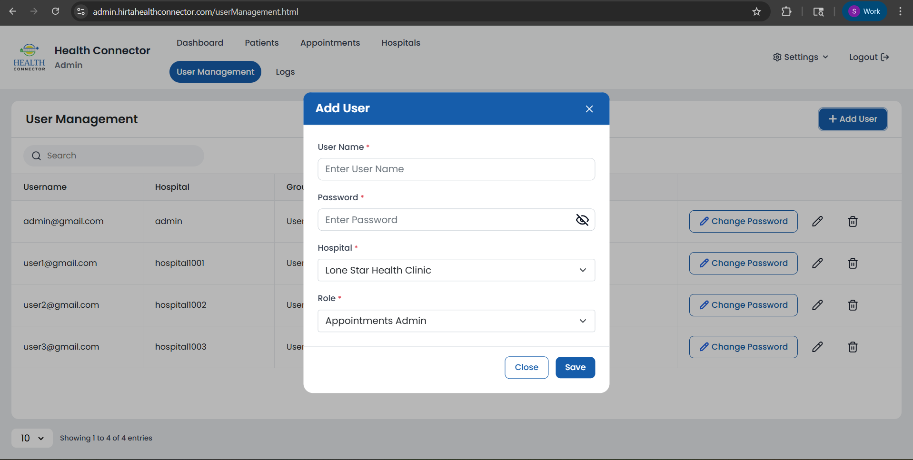

   Note: Only registered hospitals can be selected when creating users.

> **How this works technically:** unlike the rest of the app, User Management doesn't go through the backend API — the admin portal calls Amazon Cognito's admin APIs directly from the browser (create user, set password, add to group, set the `custom:hospital_id` attribute) using the logged-in admin's own temporary AWS credentials. This is why user changes take effect immediately with no separate "save" step to a database — you're editing Cognito directly.

#### Administrative Capabilities

Administrators (hospital `admin`) have access to view and manage data across all tenants, including:

- Patients
- Appointments
- Users
- Logs
- Dashboard
- Hospitals

After creating users, the administrator must provide them with:

- Their Tenant Portal URL
- Their user credentials

#### Tenant Portal Access

Each tenant accesses their dashboard using a dedicated subdomain:

- `https://<hospital_sub_domain>.<domain>.com`

The hospital subdomain can be retrieved from the Hospitals tab in the Admin Portal.

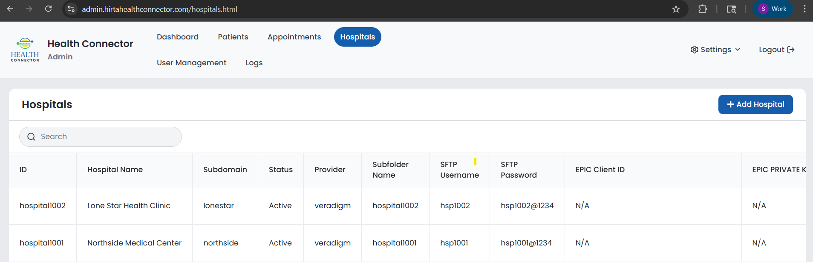

---

## User Guide

This section is intended for end users, such as hospital staff, who interact with the application dashboard.

### Accessing the Tenant Portal

Tenant users will receive the following from the Administrator:

- Tenant Portal URL
- User credentials

Users can log in to the Tenant Dashboard using the provided credentials.

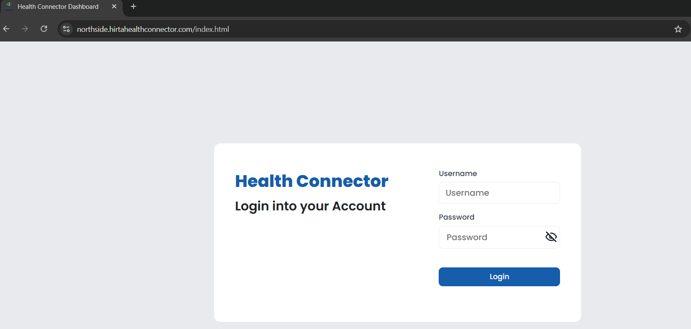

### Dashboard

After logging in, users land on the Dashboard — the main, always-available screen for day-to-day ride coordination in every environment (Development, UAT, and Production alike). It's organized around **appointments**, not raw bookings: each appointment can have up to two ride legs — **To Appointment** and **From Appointment** — and each leg gets its own row directly beneath the appointment.

For each appointment, the Dashboard shows:

- **Customer** and **Appointment** (time, location, and status) — shared across both leg rows.
- **Coordinator Notes** — a free-text note, editable inline, saved automatically when you click away from it.
- **Alternative Transportation Confirmed** — a checkbox per leg, saved immediately when toggled. A filter icon in the column header lets you hide appointments where both legs are already confirmed.
- **Direction**, **Trip Status**, **Pickup Time**, **Drop Off Time**, and **Driver/Vehicle** — specific to that leg.
- If a leg's ride hasn't been requested yet, a **Book Ride** button appears in place of the trip status, which takes you to the Book Trip page with the patient, direction, location, and time pre-filled.

Booking Admins, User Management Admins, and View Only users additionally see **Pick Up Note**, **Pick Up Spot**, **Drop Off Note**, and **Drop Off Spot** columns. View Only users see all of this but cannot edit notes, toggle confirmations, or book rides — everything renders read-only for that role, and the "Book Trip" navigation link itself is hidden for them.

Administrators (hospital `admin`) additionally see a **Hospital** column identifying which tenant each row belongs to.

#### Filtering the Dashboard

The Dashboard has three independent filtering mechanisms, all applied client-side against the appointments already loaded on the page (they don't re-query the server):

- **Filter panel** — click the funnel icon next to the search box to open a small popover with two text filters:
  - **Appointment Location** — case-insensitive substring match against the appointment's location.
  - **Drop Off Spot** — case-insensitive substring match against the leg's drop-off address.
  
  These two persist across navigation for the current browser session (saved to `sessionStorage`) — if you set one and leave the page, it's still applied, and the panel automatically reopens showing it, when you come back.
- **"Hide Confirmed" toggle** — a separate icon embedded directly in the **Alternative Transportation Confirmed** column header (not the funnel button). Toggling it hides any appointment whose *both* legs (to **and** from) are already marked confirmed; a single confirmed leg isn't enough to hide the pair. This toggle does not persist — it resets on reload or navigation.
- **Standard table search box** — the regular DataTables search, doing a plain text match across all visible columns, independent of the two filters above.

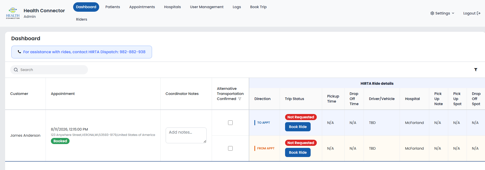

### User Management (Tenant Level)

Users with the **User Management Admin** role can create and manage users within their own tenant only. Capabilities include:

- Creating new users
- Assigning roles (Booking Admin or View Only — not User Management Admin)
- Managing existing users (edit role, change password, delete)

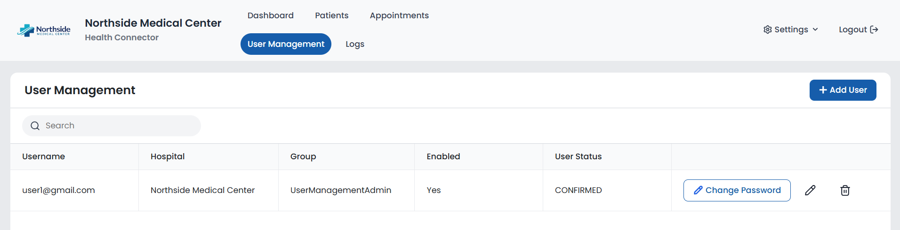

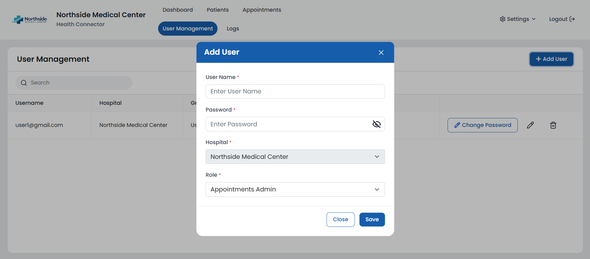

### Patient Management (Development Environments Only)

> This page redirects to the Dashboard in Production and UAT. The information below applies to Development environments.

Authorized users (Booking Admin, User Management Admin, View Only) can manage patient information, including:

- View patients
- Create patients (Booking Admin / User Management Admin only)
- Edit patient details (Booking Admin / User Management Admin only)

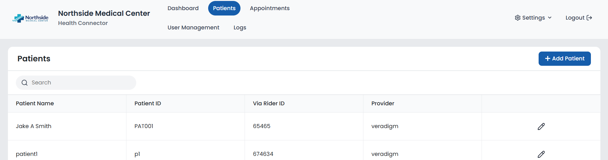

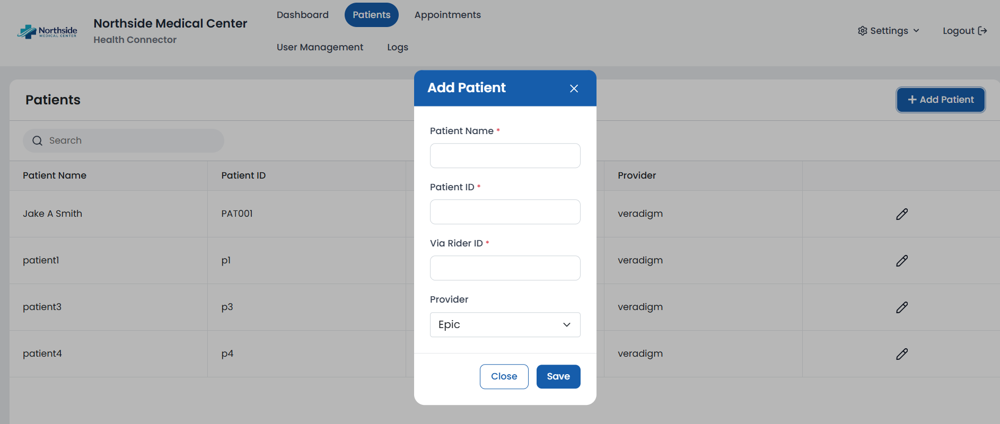

### Appointment Management (Development Environments Only)

> This page redirects to the Dashboard in Production and UAT. The information below applies to Development environments.

Users can manage appointments with the following capabilities:

- View appointments
- Create appointments (Booking Admin / User Management Admin only — administrators viewing across all hospitals cannot create appointments from this page)
- Edit appointments (Booking Admin / User Management Admin only)
- Delete appointments (Booking Admin / User Management Admin only)

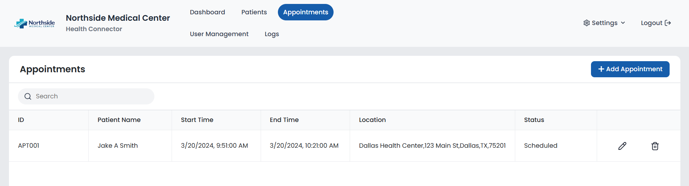

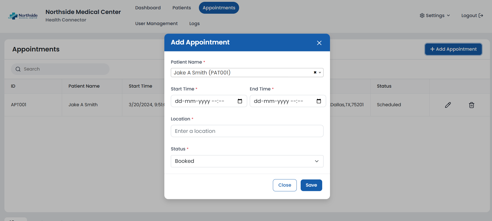

> Appointments created manually through this form are always tagged with `provider: epic` regardless of the hospital's actual provider — there's no provider selector on this form.

### User Management Permissions

Only users with the User Management Admin role have access to manage other users. These users can:

- View users
- Create users
- Edit users
- Delete users
