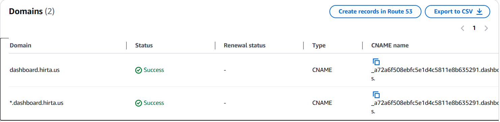
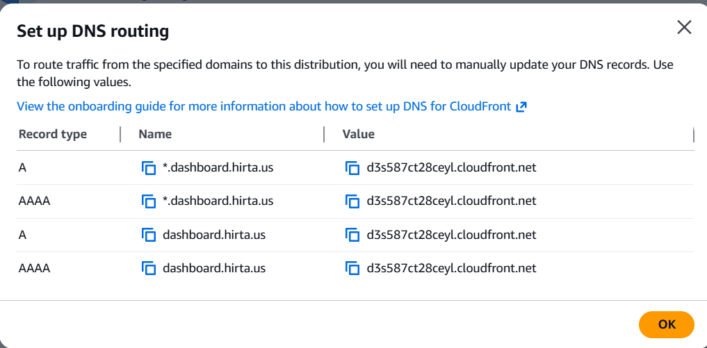

# Domain Settings for Multi-Tenant EHR Setup

1. Request a certificate for `dashboard.hirta.us` and `*.dashboard.hirta.us` in ACM.
2. Then get the CNAME and values for the two domains.

   

3. The Value is 100% right and we can use it as-is in the DNS record, but for the CNAME we need to remove `.yourdomain.com` before we add it into the GoDaddy DNS settings.
4. For example, CNAME: `_a72a6f50338ebfc5e19d4c5811e8b635291.dashboard.hirta.us.` — then remove the domain and the final value would be `_a72a6f50558ebfc5e1d46c5811e8b635291.dashboard`. (We can remove the last dot "." for both the CNAME and the value when we add them in DNS settings.)
5. After the certificate shows "Active" as the status in ACM, we now need to attach the certificate to CloudFront.
6. Navigate to CloudFront and attach the domain names `dashboard.hirta.us` and `*.dashboard.hirta.us`, and that particular certificate will be shown. Choose the certificate.
7. Now, after saving the form, click on **Route domains to CloudFront**. We get the Name and Values for DNS.
8. To route the domain to Route 53:
   - If the domain is registered through Route 53 with the same account, click on **Route domain to CloudFront**, then click **Setup Routing automatically**.
   - If the domain is registered through a third party, copy the names and update them in the DNS settings.

   

9.
10. If you are using GoDaddy as a third-party domain provider, then copy the name and value so that the final values that need to be updated are as below in the DNS settings of GoDaddy. (Leave the domain name `hirta.us` and use the rest as the CNAME; the value would be the same.)
11.

    | Name | Value |
    |---|---|
    | dashboard | d3s587ct28ceyl.cloudfront.net |
    | *.dashboard | d3s587ct28ceyl.cloudfront.net |

12.
