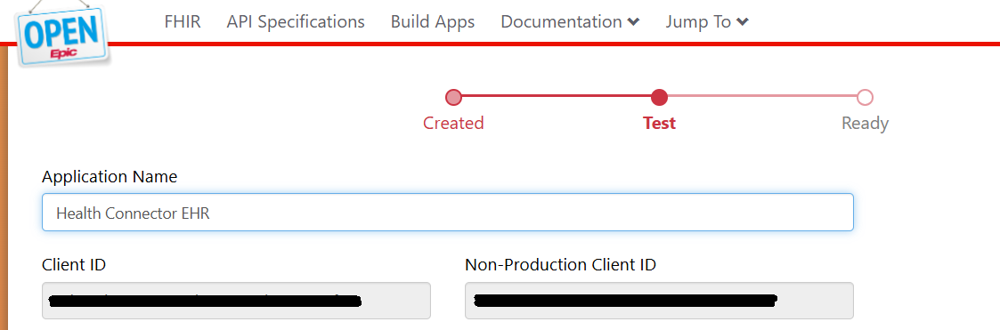
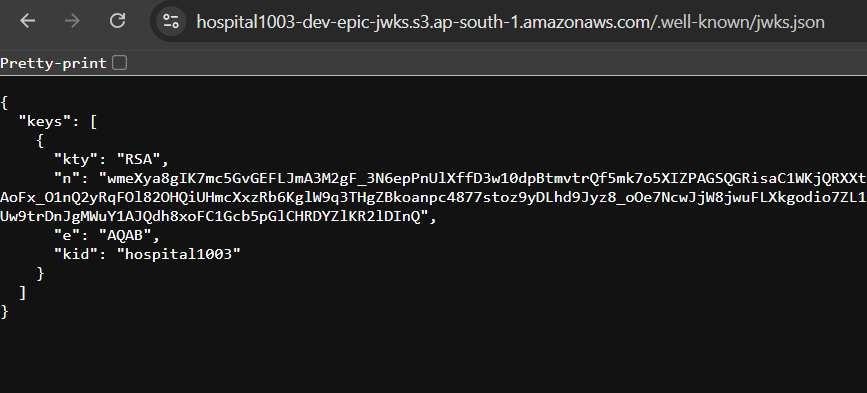
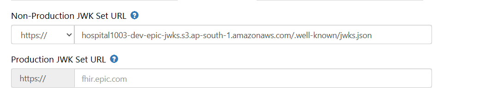
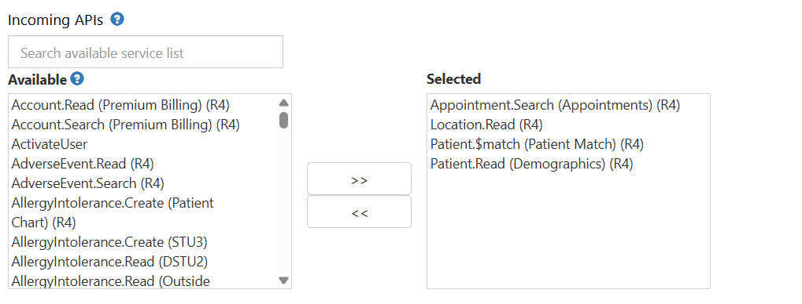
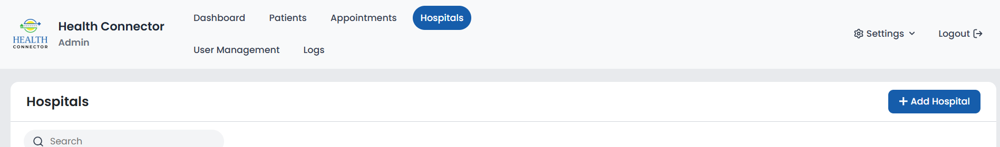
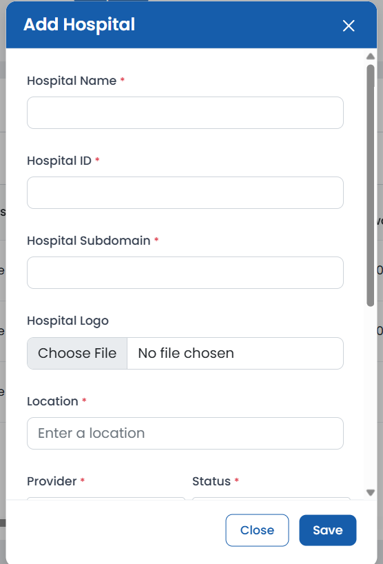
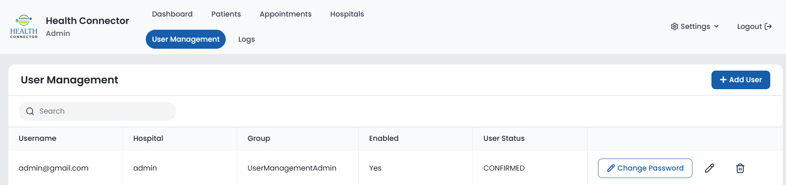
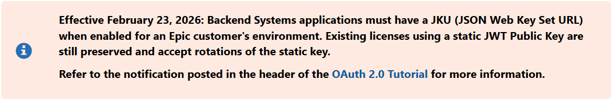

# EPIC Integration Setup Process

## Instruction for the Client (Hospital)

After the client registers in EPIC, the following credentials must be shared with the Dev team to register in the EHR app.

- **CLIENT_ID**
- **Non-Production Client ID**
- **TOKEN_URL** — (Would be a global variable for all clients, but ensure it in portal)
- **BASE_URL** — (Would be a global variable for all clients, but ensure it in portal)



### Generate SSH Private and Public Key

1. In Linux terminal.
2. ```bash
   openssl genrsa -out /path_to_key/privatekey.pem 2048
   ```
3. ```bash
   openssl req -new -x509 -key /path_to_key/privatekey.pem -out /path_to_key/publickey509.pem -subj '/CN=myapp'
   ```
4. ```bash
   openssl x509 -pubkey -noout -in /path_to_key/publickey509.pem > publickey.pem
   ```

## Create JWK Sets from Public Key

1. Open the `EPIC_INTEGRATION_SETUP_MULTI_TENANT` folder.
2. Run `npm install`.
3. Change the `kid` value in the file.
4. Run in the terminal: `node .\create_jwt_set_keys.js`.
5. Then fetch the `jwks.json` in the `jwks-files` folder.

## Generate JWKS URL

Deploy the `JWKS.json` into an S3 bucket and make it public.

1. Open AWS Console.
2. Search for S3.
3. Click **Create bucket**.
4. Enter bucket name.
5. Under Block Public Access settings:

   Uncheck:
   - ❌ Block all public access

   Then confirm the warning.

   Click **Create bucket**.

6. Open the bucket.
7. Go to **Permissions**.
8. Scroll to **Bucket Policy**.
9. Click **Edit**.
10. Paste:

    ```json
    {
      "Version": "2012-10-17",
      "Statement": [
        {
          "Sid": "PublicReadAccess",
          "Effect": "Allow",
          "Principal": "*",
          "Action": "s3:GetObject",
          "Resource": "arn:aws:s3:::<jwks-bucket-name>/*"
        }
      ]
    }
    ```

11. Replace `<jwks-bucket-name>` with your bucket name.
12. Click **Save**.
13. Inside the bucket:

    Click **Create folder**
    Name it: `.well-known`
    Create it.

14. Upload JWKS file
    - Open `.well-known`
    - Click **Upload**
    - Upload your `jwks.json`
    - Make sure:
      - Object is public (if needed)
      - Or rely on bucket policy

15. After upload, your file should be accessible at:

    ```
    https://<jwks-bucket-name>.s3.amazonaws.com/.well-known/jwks.json
    ```

    Test this in the browser.

    

## Update Credentials in EPIC System

The following credentials should be updated in the EPIC portal by the client.

**JWKS_URL** — (The bucket URL `https://<jwks-bucket-name>.s3.amazonaws.com/.well-known/jwks.json`)



**API_LIST** — (The following list of APIs should be updated in incoming API list)

| Resource | API | Endpoint | Params | Purpose |
|---|---|---|---|---|
| Appointment Resource | Appointment.Search (Appointments) (R4) | `GET https://fhir.epic.com/interconnect-fhir-oauth/api/FHIR/R4/Appointment` | `params={ "service-category": "appointment", "status": "accepted", "patient": patient_id, }` | This is the primary endpoint for fetching patient appointment data. It is queried using a patient's FHIR ID and a status of "accepted" to retrieve all upcoming, confirmed appointments, including details like start/end times and participant references. |
| Patient Resource | Patient.Read (Demographics) (R4) | `GET https://fhir.epic.com/interconnect-fhir-oauth/api/FHIR/R4/Patient/{patientId}` | N/A | Used to fetch detailed demographic information for a specific patient, such as their name, phone numbers, and email address. |
| Location Resource | Location.Read (R4) | `GET https://fhir.epic.com/interconnect-fhir-oauth/api/FHIR/R4/Location/{locationId}` | N/A | When an appointment contains a reference to a location, this API is called to get the full address and contact information. |



## Onboarding of an EPIC Tenant in Admin Portal

1. Login through the admin portal in EHR.
2. Navigate to Hospital Tab.
3. Click on **Add Hospital**.

   

4. Enter:
   - Hospital Name
   - Hospital ID (Unique String)
   - Hospital Subdomain (Custom portal subdomain)
   - Hospital Logo (Insert a logo for branding — PNG format)
   - Location (Hospital Location)
   - Status (Active)
   - Provider (Epic)
   - EPIC Client ID (`CLIENT_ID`)
   - EPIC Private Key (Private key generated)
   - EPIC JWKS URL (`JWKS_URL`)
   - EPIC JWKS KID (Key ID used for creating the JWKS URL)

   

5. Click on **Save**.
6. Navigate to the User Management tab and create a user for the hospital with a role.

   

7. Use the user credentials to login through `<hospital_subdomain>.<EHR_domain>.com`.

---

## Architecture of EPIC in EHR

The Epic integration is designed as a scheduled, polling-based system that synchronizes appointment data from Epic's FHIR API into our application's database.

### 1. Scheduled Trigger (EventBridge)

- An AWS EventBridge rule triggers the `epic_data_populator` Lambda function every 2 minutes.

### 2. Tenant Resolution (Hospital Lookup)

- The Lambda function scans the Hospital DynamoDB table to find all hospitals where the provider is set to `'epic'`. This allows the system to handle multiple Epic tenants (hospitals) dynamically.

### 3. Patient Identification

- For each identified hospital, the function queries the Patient DynamoDB table.
- It looks for patients who belong to that hospital and have a valid `via_rider_id`. This ensures the system only fetches data for patients who have opted into the transportation service.

### 4. Authentication (Smart on FHIR)

- The system generates a JWT (JSON Web Token) dynamically for the specific hospital.
- It uses the `epic_client_id`, `epic_jwks_url`, `epic_kid`, and `epic_private_key` stored in that hospital's record in DynamoDB. This allows Lambda to authenticate with Epic as a backend service (Backend Service Authorization).

**Token extraction process:**

- **Client-Side Signing:** When the application wants to get an access token from Epic, it creates a JSON Web Token (JWT) and signs it with a private key. This proves its identity to Epic.
- **Server-Side Verification:** The Epic authorization server then needs to verify that the JWT was legitimately signed by this application. To do this, it needs the corresponding public key.
- **The JWKS Endpoint:** The `create_jwks_bucket` method creates a public, well-known location (an HTTP endpoint) where the application's public keys are published. This is the JSON Web Key Set (JWKS). Epic's server fetches the keys from this URL to perform the verification.

> **Effective February 23, 2026:** Backend Systems applications must have a JKU (JSON Web Key Set URL) when enabled for an Epic customer's environment. Existing licenses using a static JWT Public Key are still preserved and accept rotations of the static key.
>
> Refer to the notification posted in the header of the OAuth 2.0 Tutorial for more information.



### 5. Data Processing & Storage

- The Epic API returns appointment data (start time, end time, location, status, `patient_phone_no`, `patient_email`).
- The Lambda parses this data, maps it to your internal data model, and saves the records into the Appointment DynamoDB table.

### Key Technical Components

**Multi-Tenancy:** The architecture supports multiple hospitals. Each hospital record stores its own credentials (`epic_private_key`, `epic_client_id`), ensuring data isolation and correct authentication context for each API call.

**Security:** Private keys are stored in the database (likely encrypted or managed via secrets in a production environment) and used to sign JWTs on the fly, adhering to the Smart on FHIR backend services standard.

**Efficiency:** The system only queries Epic for patients who explicitly have a `via_rider_id` in your system, preventing unnecessary API calls for patients not using the transportation service.
