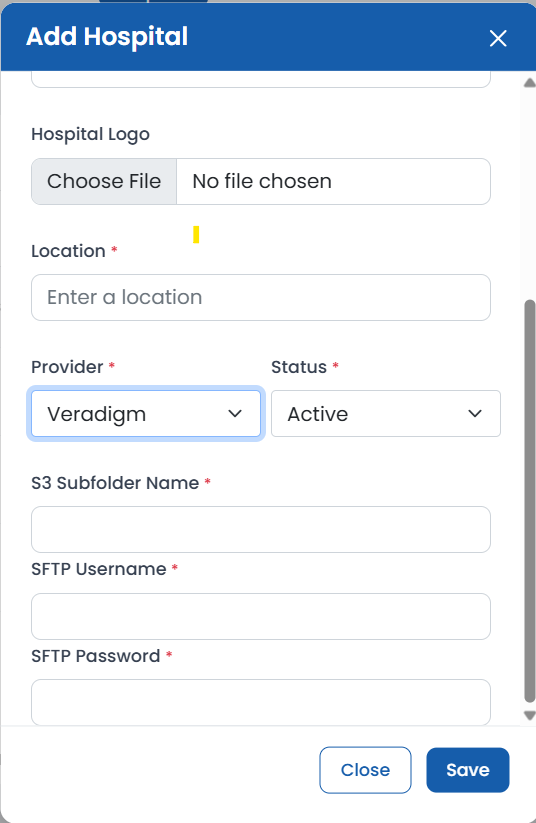

# Veradigm Integration Setup Process

## Overview

The Veradigm integration is a file-based data exchange that operates over SFTP (Secure File Transfer Protocol). Unlike the Epic integration, which uses APIs, Veradigm providers upload their appointment data as CSV files to a secure server. The system automatically processes these files to populate appointment and patient data.

Multi-tenancy is handled by assigning each provider a unique subfolder on the SFTP server. The system uses this subfolder to identify the provider and correctly associate the data with the right `hospital_id`.

## Onboarding and Setup Process

To onboard a new Veradigm provider, an administrator must perform the following steps using the admin dashboard:

1. **Navigate to the Hospitals Page:** Log in to the admin dashboard and go to the "Hospitals" management page.
2. **Create a New Hospital:** Click the "Add Hospital" button.
3. **Fill in Hospital Details:**
   - **Provider:** Select `veradigm` from the dropdown menu. This reveals the Veradigm-specific configuration fields.
   - **S3 Subfolder Name:** Enter a unique, simple name for the provider (e.g., `dallas_county_medical`). This becomes the subfolder the client must upload their files into. It must not contain spaces or special characters.
   - **SFTP Username:** Create a unique username for the client.
   - **SFTP Password:** Create a secure password for the client.
   - Fill in all other required hospital information (Name, ID, Subdomain, etc.).
4. **Save the Hospital:** Click "Save New Hospital". The system is now ready to receive files from this provider.

> `SFTP Username` is saved directly on the hospital's DynamoDB record, but `SFTP Password` is not — it's extracted and stored only in AWS Secrets Manager, under a per-hospital secret. The hospital must also be saved with **Status: Active** — the SFTP identity provider rejects logins for any hospital not in `Active` status.

## Instructions for the Veradigm Client

Once the setup is complete, provide the following information to the Veradigm client:

- **SFTP Endpoint:** The hostname of the AWS Transfer Family SFTP server (e.g., `s-xxxxxxxx.server.transfer.us-east-1.amazonaws.com`).
- **SFTP Username / Password:** The credentials configured in administration.
- **Folder Path:** The S3 Subfolder Name configured in administration. All CSV files must be uploaded directly into this folder.
- **File Name:** Any file ending in `.csv` is picked up automatically — the upload trigger filters on the `.csv` suffix only, not a specific file name.
- **Required CSV Columns** (header row, comma-delimited):

  | Column | Required | Notes |
  |---|---|---|
  | `Patient Number` | Yes | Used as the patient's unique ID. |
  | `Patient First Name` | Yes | |
  | `Patient Middle Initial` | No | |
  | `Patient Last Name` | Yes | |
  | `Appointment ID` | Yes | Used as the appointment's unique ID. |
  | `Appointment DateTime` | Yes | **Must be in `YYYYMMDD_HHMMSS` format** (e.g. `20260325_090000`), interpreted in **America/Chicago (Central) time**. Any other format fails validation. |
  | `Appointment Duration` | Yes | Minutes; used to compute the appointment's end time. |
  | `Status` | Yes | Must be exactly `Booked` for the appointment to be picked up by ride-matching (see Architecture, below). |
  | `Location Name` | Yes | |
  | `Location Street1` | Yes | |
  | `Location Street2` | No | |
  | `Location City` | Yes | |
  | `Location State` | Yes | |
  | `Location Zip` | Yes | |
  | `Location Phone Number` | Yes | Required for the file to validate, but not currently persisted onto the appointment record. |
  | `Scheduling Location Description` | Yes | Required for the file to validate, but not currently persisted onto the appointment record. |

  > Every row in the file is validated before any of it is saved. If a single row fails validation (e.g., a malformed date), the entire file's processing fails — there's no partial-success behavior today.

---

## Architecture of Veradigm in EHR

The data flow for the Veradigm integration follows these steps:

1. **Authentication:** The Veradigm client connects to the AWS Transfer Family SFTP server using their assigned username and password.
2. **Identity Provider:** The SFTP server authenticates the client by invoking a dedicated Lambda function (`sftp_identity_provider`). This function looks up the hospital by scanning the Hospital DynamoDB table for a matching `sftp_username`, confirms the hospital's `status` is `Active`, then retrieves the expected `sftp_password` from that hospital's AWS Secrets Manager secret (not from DynamoDB) and compares it against the password the client supplied. On success, it returns a scoped IAM policy restricting the session to that hospital's subfolder only (`{bucket}/{s3_subfolder_name}/*`).
3. **File Upload:** Once authenticated, the client uploads their appointment CSV file into their designated subfolder within the SFTP S3 bucket.
4. **Trigger:** The S3 bucket is configured to send an `ObjectCreated` event to the `datapopulator_lambda` function whenever a new file with a `.csv` suffix is uploaded.
5. **Tenant Resolution:** `datapopulator_lambda` identifies the provider by scanning the Hospital table for the record whose `s3_subfolder_name` matches the uploaded file's subfolder, and uses that hospital's `id` to tag every record it creates.
6. **Database Population:** The Lambda parses the CSV (validating every row against the column list above), then for each row:
   - Creates the appointment in the Appointments table, tagged with the resolved `hospital_id` and `provider: "veradigm"`.
   - Creates a new Patient record if the `Patient Number` hasn't been seen before for that hospital (with no `via_rider_id` yet), or updates the existing patient's name if it has changed.
   - Writes one entry to the SFTP Logs table recording the file name and its S3 last-modified timestamp.
7. **Ride Matching:** If the patient already has a `via_rider_id` linked at the moment the file is processed, the Lambda immediately calls Via to fetch that rider's trips and matches a `to_appointment` and `from_appointment` ride onto the new appointment based on timing and pickup/dropoff proximity to the appointment location. A brand-new patient created straight from the CSV has no `via_rider_id` yet, so their appointment is saved without a matched ride at ingestion time. Separately, the same Lambda also runs on a **~2-minute EventBridge schedule** and re-scans every appointment with status `Booked` and a future end time (Veradigm and Epic alike) to (re)match rides for any patient who now has a `via_rider_id` linked — including ones that weren't linked yet at upload time — while preserving previously-matched driver/vehicle info if the same trip is still matched.

### Key Technical Components

**Multi-Tenancy:** Each hospital's SFTP session is isolated to its own S3 subfolder via the IAM policy issued at authentication time, and every record the pipeline creates is explicitly tagged with the resolved `hospital_id`.

**Security:** The `sftp_password` is stored only in AWS Secrets Manager, never in DynamoDB. Note that the identity provider compares the submitted password to the stored one with a plain string equality check, not a constant-time comparison.

**Efficiency:** Ride-matching only calls out to Via for patients who have an explicitly linked `via_rider_id`, and the periodic re-match pass only considers appointments that are still `Booked` and haven't already ended.
